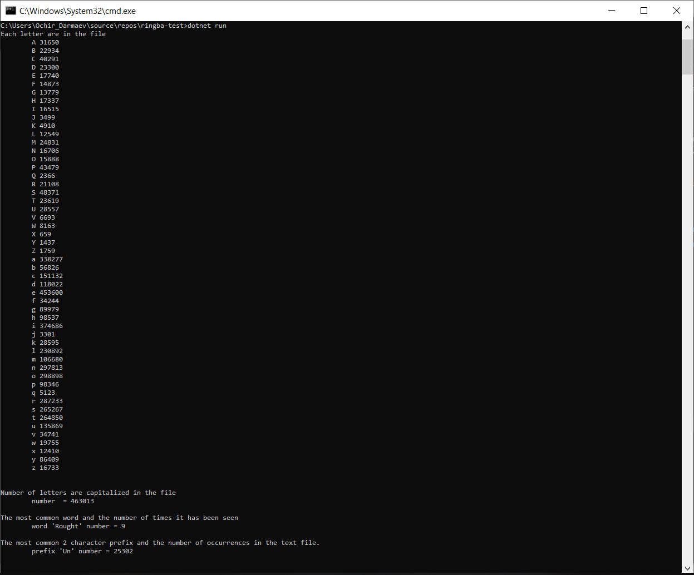

# ringba-test

Demo


# console output
```
Each letter are in the file
	A 31650
	B 22934
	C 40291
	D 23300
	E 17740
	F 14873
	G 13779
	H 17337
	I 16515
	J 3499
	K 4910
	L 12549
	M 24831
	N 16706
	O 15888
	P 43479
	Q 2366
	R 21108
	S 48371
	T 23619
	U 28557
	V 6693
	W 8163
	X 659
	Y 1437
	Z 1759
	a 338277
	b 56826
	c 151132
	d 118022
	e 453600
	f 34244
	g 89979
	h 98537
	i 374686
	j 3301
	k 28595
	l 230892
	m 106680
	n 297813
	o 298898
	p 98346
	q 5123
	r 287233
	s 265267
	t 264850
	u 135869
	v 34741
	w 19755
	x 12410
	y 86409
	z 16733


Number of letters are capitalized in the file
	number  = 463013

The most common word and the number of times it has been seen
	word 'Rought' number = 9

The most common 2 character prefix and the number of occurrences in the text file.
	prefix 'Un' number = 25302
```	

# Thanks